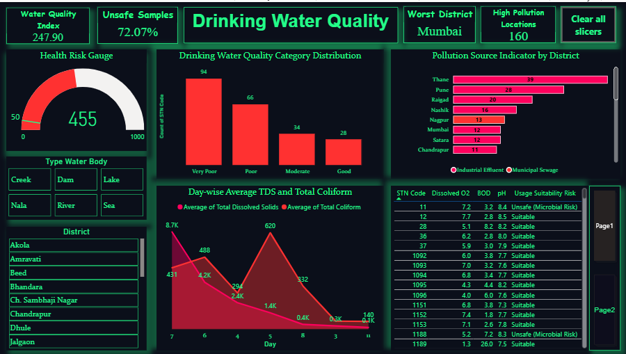
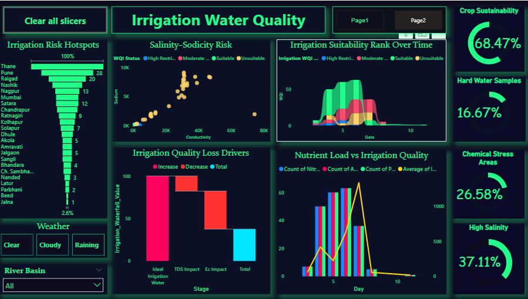

# 💧 Water Quality Evaluation and Risk Identification Study (2025)

**Tools:** Power BI | Excel | DAX | Power Query | Data Modeling  
**Domain:** Environmental Analytics | Water Resource Management  

Power BI • Excel • DAX • Environmental Analytics  

---

## 🧩 Project Overview
This project analyzes river water quality across Maharashtra (2025) using environmental monitoring data.  
The study evaluates drinking and irrigation water suitability based on CPCB and WHO standards, while identifying pollution hotspots, contamination risks, and environmental stress factors.

Using Power BI, the dataset was cleaned, transformed, modeled, and visualized to generate actionable insights for public health, environmental sustainability, and agricultural planning.

---

## 🎯 Project Objectives

### 1. Evaluate Water Quality
Assess river water quality using physical, chemical, and biological parameters.

### 2. Determine Drinking Suitability
Analyze whether water meets CPCB and WHO standards for safe drinking.

### 3. Assess Irrigation Suitability
Evaluate water quality for agricultural use based on FAO standards.

### 4. Identify Pollution Hotspots
Detect highly polluted districts and monitoring stations.

### 5. Analyze Environmental Risks
Study microbial contamination, salinity, and chemical stress impact.

---

## 📂 Data Sources
**Sources & Timeline:**
- 📅 Indian Data Portal (MPCB – August 2025)  
https://www.data.gov.in/resource/nwmp-water-sampling-data-maharashtra-maharashtra-pollution-control-board-mpcb-during  

**Domain:** Environment  

---

## ❓ Problem Statement
- Evaluate river water quality across Maharashtra using multiple parameters  
- Identify unsafe water for drinking and irrigation  
- Detect pollution hotspots and high-risk districts  
- Analyze impact of chemical and microbial contamination  
- Develop an interactive dashboard for monitoring water risks  

---

## 🧾 Attribute Details (Key Features)

| Attribute | Description |
|----------|------------|
| STN Code | Unique station identifier |
| Sampling Date | Date of water sample collection |
| District | Location of sampling |
| Type Water Body | River, Lake, Dam, etc. |
| Dissolved Oxygen | Indicator of water health |
| pH | Acidity/alkalinity level |
| BOD | Organic pollution indicator |
| Total Coliform | Microbial contamination |
| Conductivity | Salinity indicator |
| TDS | Total dissolved solids |
| Nitrate, Phosphate | Nutrient levels |
| Sodium, Chlorides | Irrigation suitability factors |

---

## 🧹 Data Preprocessing Steps

### Data Cleaning (Excel / Power Query)
- Removed duplicate records  
- Handled missing values  
- Standardized categorical values  
- Converted date/time formats  
- Cleaned latitude & longitude  

### Data Transformation
- Filtered drinking and irrigation datasets  
- Created pivot summaries  
- Structured data into Fact & Dimension tables  

### Data Modeling
- Star schema implemented  
- Fact Table: Water Sampling Data  
- Dimension Table: Calendar  

---

## 📐 Key Metrics & Calculations

- Drinking Water Quality Index (WQI)  
- Irrigation Water Quality Index (WQI)  
- % Unsafe Drinking Water  
- % Suitable for Irrigation  
- High Pollution Locations  
- High Salinity Locations  
- Chemical Stress Indicator  
- Worst Affected District  

---

## 📊 Analysis & Visualizations

Developed two interactive Power BI dashboards:

### 🔹 Drinking Water Dashboard
- WQI KPI & Risk Categories  
- % Unsafe Drinking Water  
- Worst Affected District  
- Pollution Source Analysis  
- Water Quality Distribution  
- TDS & Coliform Trends  

### 🔹 Irrigation Water Dashboard
- Crop Sustainability KPI  
- % Hard Water Samples  
- High Salinity Locations  
- Chemical Stress Areas  
- Irrigation Risk Hotspots  
- EC vs Sodium Analysis  

---

## 📸 Dashboard Preview

### 🔹 Drinking Water Quality Dashboard

  

### 🔹 Irrigation Water Quality Dashboard

  

---

## 📈 Key Insights

### 🟢 Drinking Water
- 72% of samples are unsafe for drinking  
- Mumbai is the worst affected district  
- High microbial contamination observed  
- Industrial effluent is the major pollution source  

### 🌾 Irrigation Water
- 68% of water is suitable for irrigation  
- 37% locations show high salinity  
- 26% areas are under chemical stress  
- High EC and TDS reduce crop sustainability  

---

## 🧠 Conclusion
This project demonstrates end-to-end environmental data analysis using Excel and Power BI.  
The integration of real-world data with CPCB, WHO, and FAO standards enabled accurate classification of water quality and identification of environmental risks.

The dashboards provide actionable insights for:
- Government agencies  
- Environmental authorities  
- Agricultural planners  

to ensure sustainable water resource management.

---

## 🚀 Future Enhancements
- Real-time IoT-based water monitoring  
- Machine Learning prediction models  
- Advanced geospatial mapping  
- Automated alert system for pollution detection  

---

## 👤 Author
**Kamali K**  
Data Analyst | Power BI Developer  

---

## 📚 Tags
#PowerBI #DataAnalytics #EnvironmentalData  
#WaterQuality #DataVisualization #DAX #Excel
